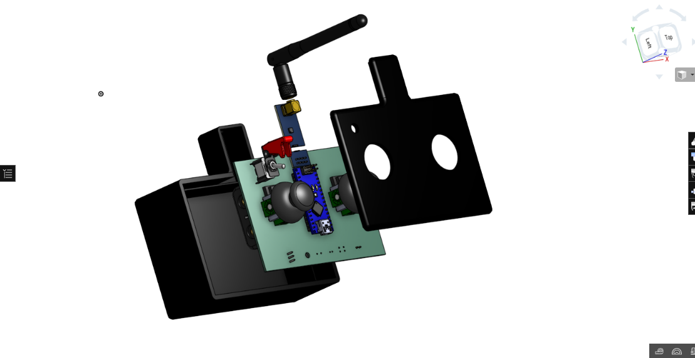
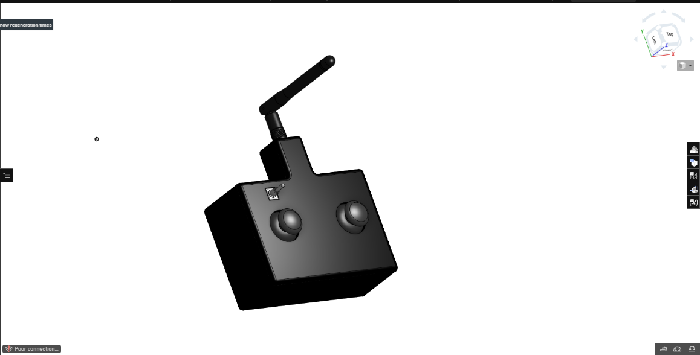
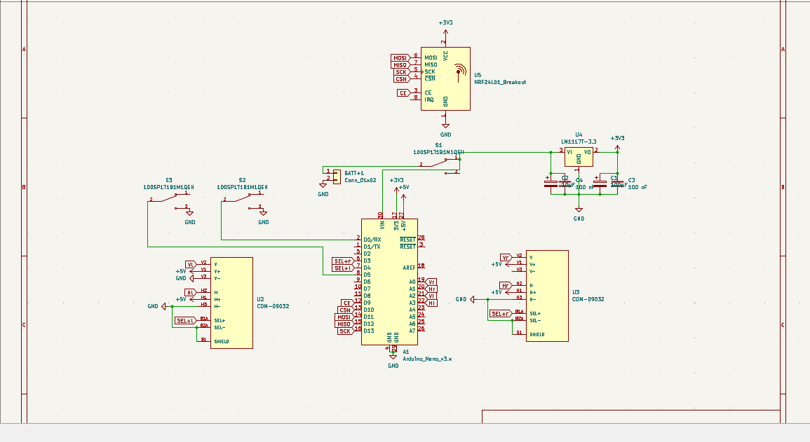
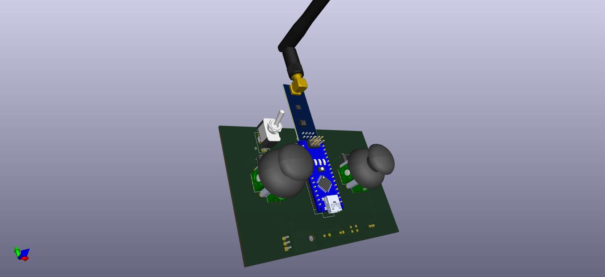
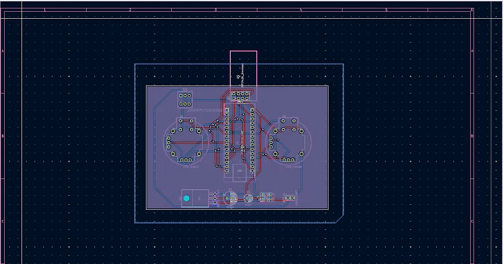
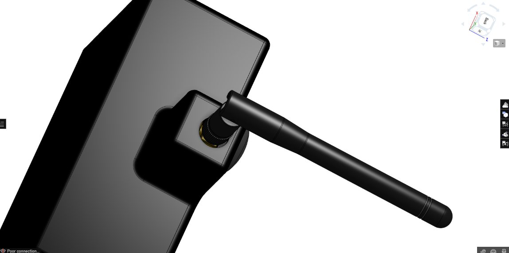

# Transceiver_101
This is a universal remote controller for almost any remote device e.g. Planes,drones,boats or rc cars. It can be mounted and set up in any custom project the needs remote controlling.
---

# Key Features 
-can be used to controll almost any project

-customisable for drone flight controllers

-6 channel controller

-up to 2.5km range 

-Custom code to change as needed

# Images

There is a notch that shuold be kept in mind. 

# BOM

parts used in this project

-Arduino Nano X2

- NRF24L01+PA+LN 100mW (E01-ML01DP5) X1

-NRF24L01+PA+Wireless SMD X1

-100uF (16V or above) electrolytic capacitors X2

-10uF electrolytic capacitors X2

-100nF (104) ceramic capacitor X2

-100nF (104) ceramic capacitor X2

-2×4 pin Header X2

- 2.4G Antenna Adapter Cable X1

-Toggle switch with plastic cover X1

-Male Headers X1

# Firmware
This remote and receiver uses C++ that is for arduino IDE

Made by Rubaiyat Islam

